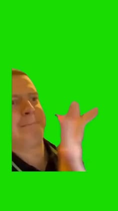

> **Дата:** 15.09.2026 
> **Автор (ФИО):** Михайлов, Егоров, Димов.

## ВЫПОЛНЕННЫЕ ШАГИ
1. Освоена навигация в системе через команды.
2. Создана и очищена структура папок 'Лабиринт'.
3. Установлены и протестированы утилиты визуализации.

 ## ЛАБИРИНТ
[Открыть текстовый файл](document.txt)

## ОТЧЕТ СИСТЕМЫ
### Системная информация

### Красивый текст

### Сообщение от Cowsay

